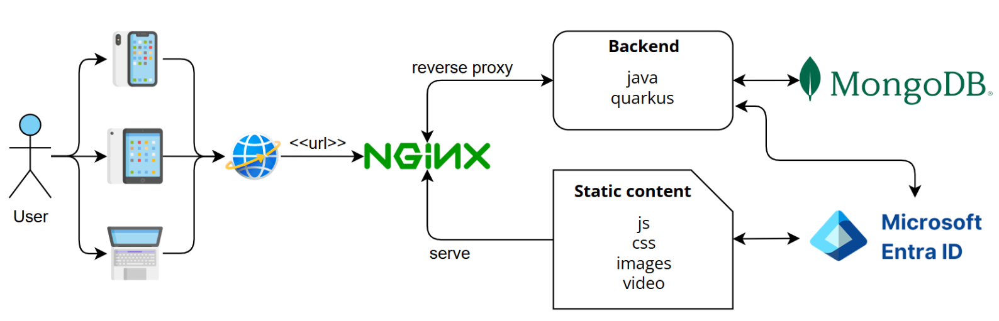
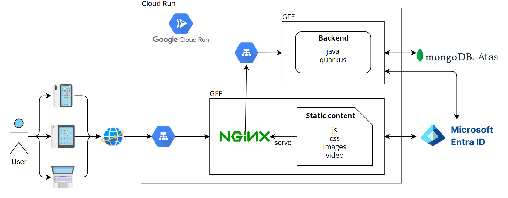

# Mirir: Interactive Educational Platform for Learning

## Project Description

Mirir is an interactive educational platform that leverages gamification to boost student engagement. Designed after a needs analysis at SUPSI (Scuola Universitaria Professionale della Svizzera Italiana), it addresses accessibility, continuity, and cost-free requirements unmet by existing solutions (Kahoot, Wooclap).

The system uses a microservices architecture:
- **Backend**: Java + Quarkus, optimized with GraalVM; data stored in MongoDB.
- **Frontend**: React + TypeScript, built with Vite, communicates via OpenAPI-defined REST APIs.
- **Containerization & Hosting**: Docker + Google Cloud Run (serverless).
- **Authentication**: Microsoft Azure Entra ID.

The current release allows course creation, thematic folder organization, asynchronous quizzes, question bank management, imports, and detailed statistics (true/false & multiple choice).

---

## Features
- 🎓 **Course Management**: Create, edit, and organize courses in folders.
- ❓ **Asynchronous Quizzes**: Design, publish, and link quizzes to courses.
- 📚 **Shared Question Bank**: Reuse questions across quizzes.
- 🔄 **Import Questions**: Bulk import via JSON/CSV.
- 📊 **Statistics Dashboard**: Aggregated and per-user performance data.
- 🔒 **Secure Auth**: Azure Entra ID integration for SSO.

---


## Architecture
  
*Figure: High-level microservices architecture.*

  
*Figure: Cloud-native deployment on GCP Cloud Run.*

---

## Technologies
**Backend**:
- Java 21, Quarkus
- GraalVM native image
- MongoDB 6.x
- MicroProfile Config & SmallRye Health/OpenAPI

**Frontend**:
- React 18, TypeScript
- Vite build tool
- Axios HTTP client

**Infrastructure**:
- Docker & Docker Compose
- Google Cloud Run (serverless)
- Artifact Registry
- Azure Entra ID (OIDC)

---

## Installation

### Prerequisites
- Java 21 & Maven
- Node.js v18+ & npm


### Development Setup

*Backend:*
``` bash 
cd backend
mvn clean package
cd target/backend-api-client
npm i
npm link
cd ....
mvn quarkus:dev
```

*Frontend:*
``` bash
npm i
npm link @dti-isin/backend-api-client
npm run dev
```


### Testing

*Backend tests:*
``` bash
mvn quarkus:test
```

*Frontend tests:*
``` bash
npm run test
# For coverage report
npm run coverage
```

## Usage

The application is accessible at: [https://frontend-service-1031980811194.europe-west12.run.app/](https://frontend-service-1031980811194.europe-west12.run.app/)

Users can perform all operations described in the project description:
- Create and manage courses and thematic folders
- Create and publish asynchronous quizzes
- Manage the shared question bank
- Import questions
- View aggregated and individual statistics
- Create true/false and multiple choice questions